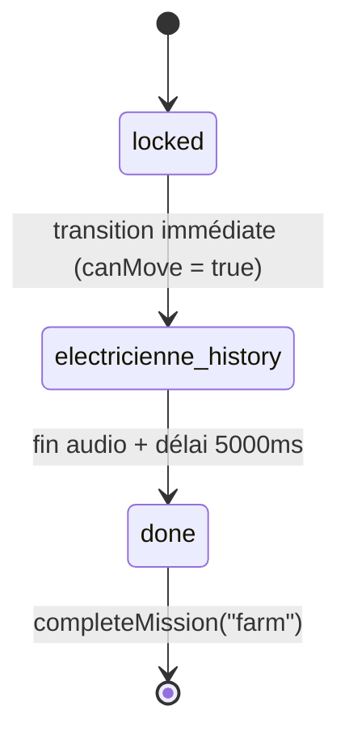

# Missions Pylon et Farm

Ce document décrit l'implémentation des missions 2 (Pylon) et 3 (Farm) dans La Fabrik. Ces deux missions encadrent la boucle de réparation partagée définie dans `repair-game.md`.

## Vue d'ensemble

| Mission | Objet         | Ordre | Résumé narratif                                       |
| ------- | ------------- | ----- | ----------------------------------------------------- |
| `pylon` | Pylône électrique | 2 | L'électricienne guide le joueur pour redresser un pylône tombé et réparer ses composants |
| `farm`  | Ferme verticale   | 3 | Un narrateur audio raconte l'histoire de l'électricienne pendant la réparation de l'irrigation |

Les deux missions utilisent la boucle de réparation générique (`RepairGame`) pour leurs étapes `waiting → done`. Chaque mission ajoute des étapes narratives spécifiques avant et/ou après cette boucle.

---

## Mission Pylon

### Flux d'étapes complet

```txt
locked → tampon → approaching → arrived → [repair game: waiting…done] → npc-return → inspected → done → narrator-outro
```

```mermaid
stateDiagram-v2
  [*] --> locked
  locked --> tampon: joueur entre dans PYLON_APPROACH_ZONE
  tampon --> approaching: délai 7500ms
  approaching --> arrived: joueur entre dans PYLON_ARRIVED_ZONE
  arrived --> waiting: RepairGame prend la main (étapes repair partagées)
  waiting --> done: fin du repair game
  done --> npc-return: SFX powerup joué
  npc-return --> inspected: audio electricienneApresMontage terminé
  inspected --> narrator-outro: délai 5000ms (demo skip)
  narrator-outro --> [*]: completeMission("pylon")
```

**Note :** les étapes `waiting → done` sont gérées par `RepairGame`. Les étapes avant et après sont propres à la mission pylon et gérées par `PylonNarrativeFlow`.

### Étapes narratives détaillées

#### `locked`
- `ZoneDetection` surveille `PYLON_APPROACH_ZONE` (position `[5, 4, -21.5]`, rayon 10, hauteur 18, one-shot).
- Transition vers `tampon` à l'entrée de la zone.

#### `tampon`
- `setTimeout(PYLON_APPROACH_DELAY_MS = 7500ms)` avant de déclencher la séquence approche.
- Sert de tampon entre la détection de zone et le blocage du joueur.

#### `approaching`
- Mouvement bloqué (`canMove = false`).
- SFX `generateur-powerdown.mp3` joué via `AudioManager`.
- Dialogue `electricOutage` joué à la suite.
- Mouvement débloqué à la fin du dialogue.
- `ZoneDetection` surveille `PYLON_ARRIVED_ZONE` (centré sur `PYLON_WORLD_POSITION`, rayon 30, one-shot).
- Transition vers `arrived` à l'entrée.

#### `arrived`
- Dialogue `searchCentral` joué via `useDialoguePlayback`.
- `PylonFarmerNPC` visible : l'électricienne est à `PYLON_FARMER_NPC_POSITION`.
- `PylonDownedPylon` visible : le pylône est couché (`PYLON_DOWNED_ROTATION [0, 0, -0.9]`).
- Trigger interactable sur le pylône → dialogue `brokenPylon` puis `demandeAide`.
- Trigger interactable sur l'électricienne → dialogue `electricienneWelcome`, transition vers `npc-return` à la fin.
- Le repair game prend ensuite la main (`waiting → done`).

#### `npc-return` (post-repair)
- SFX `generateur-powerup.mp3` joué à l'entrée de l'étape `done`.
- L'électricienne marche vers `PYLON_FARMER_NPC_AFTER_POSITION` à `PYLON_FARMER_NPC_WALK_SPEED = 2` unités/s.
- Animation `push` déclenchée quand `pylonStraighteningSignal.started` passe à `true`.
- Pendant ce temps, `PylonDownedPylon` anime le pylône de `-0.9` à `0` rad sur l'axe Z en `2200ms` (cubic ease-out).
- Quand `pylonStraighteningSignal.completed` passe à `true`, l'électricienne repasse en `idle` et joue `electricienneApresMontage`.
- Fin du dialogue → `setMissionStep("pylon", "inspected")`.

#### `inspected`
- Placeholder demo : `setTimeout(5000ms)` puis `setMissionStep("pylon", "done")`.
- En production, cette étape accueillerait une interaction supplémentaire.

#### `done`
- SFX `generateur-powerup.mp3`.
- Transition vers `narrator-outro` à la fin du SFX.

#### `narrator-outro`
- `PylonNarratorOutro` monte (headless).
- Mouvement bloqué.
- Dialogue `electricienneAurevoir` joué, puis `narrateur_courantrepare`.
- Fin de `narrateur_courantrepare` → mouvement débloqué + `completeMission("pylon")`.
- `completeMission("pylon")` : `mainState` passe à `"farm"`, `pylon.isPowered = true`.

### Éclairage narratif

`PylonLightingEffect` est un composant headless R3F (retourne `null`). Il lerpe les couleurs ambiante et solaire vers une palette bleu-violet/lavande pendant les étapes `approaching → npc-return`, et revient aux valeurs par défaut à `done` et `narrator-outro`.

| Actif entre         | Couleur ambiante | Couleur solaire |
| ------------------- | ---------------- | --------------- |
| `approaching` → `npc-return` | `#7b87c8` | `#a882d4` |
| `done` / `narrator-outro` | valeurs par défaut | valeurs par défaut |

Vitesse de lerp : 0.8 par seconde.

### Signal de synchronisation `pylonStraighteningSignal`

```txt
src/components/gameplay/pylon/pylonSignals.ts
```

Objet mutable partagé `{ started: false, completed: false }`. Évite le prop drilling entre `PylonDownedPylon` (qui anime le pylône) et `PylonFarmerNPC` (qui réagit au signal pour changer d'animation).

`PylonDownedPylon.beginStraighten()` :
1. Pose `started = true`.
2. Lance l'animation de rotation du pylône (cubic ease-out, 2200ms).
3. Pose `completed = true` à la fin.
4. Bloque le mouvement joueur pendant l'animation.

`PylonFarmerNPC` lit le signal à chaque frame dans `useFrame` et réagit sur les fronts montants.

### Composants principaux

| Fichier | Rôle |
| ------- | ---- |
| `PylonNarrativeFlow.tsx` | Orchestrateur. Monte les détections de zone, séquence les dialogues, route les étapes. Retourne `null` si `mainState !== "pylon"`. |
| `PylonDownedPylon.tsx` | Modèle du pylône couché + animation de redressement + triggers interactables. |
| `PylonFarmerNPC.tsx` | NPC électricienne : walk, push, idle, dialogues, réaction au signal. |
| `PylonLightingEffect.tsx` | Lerpe l'éclairage global vers la palette pylon. Headless. |
| `PylonNarratorOutro.tsx` | Joue les deux dialogues de fin et appelle `completeMission`. Headless. |

### Config et données

| Fichier | Contenu |
| ------- | ------- |
| `src/data/gameplay/pylonConfig.ts` | Positions monde, rotations, vitesses, durées, IDs de dialogue. |
| `src/data/gameplay/zones.ts` | `PYLON_APPROACH_ZONE` et `PYLON_ARRIVED_ZONE`. |
| `src/data/gameplay/repairMissions.ts` | Config repair game pylon : modèle, pièces cassées (`lampe`, `pylone`), pièces de remplacement (`pylon-cable-*-replacement`), timings. |

### Repair game pylon

Référence : `repair-game.md`.

Paramètres spécifiques :

| Paramètre | Valeur |
| --------- | ------ |
| Modèle | `/models/pylone/model.glb` |
| `reassemblySeconds` | 1.8 |
| `scanPartSeconds` | 1.4 |
| Pièces cassées | `lampe` (relais grille), `pylone` (panneau endommagé) |
| Remplacement accepté | `pylon-cable-right-replacement` ou `pylon-cable-left-replacement` (même nœud `cable2`, `caseLockGroup: "pylon-cable"`) |
| Position `RepairGame` | `[64, 0, -66]` dans `GameStageContent.tsx` |

---

## Mission Farm

### Flux d'étapes complet

```txt
locked → electricienne_history → done
```

La mission farm est intentionnellement légère côté gameplay : elle conclut la session avec un récit audio sans interaction complexe.



**Note :** contrairement à pylon, la mission farm utilise la boucle repair game (`waiting → done`) avant `electricienne_history`. L'étape `electricienne_history` est une étape narrativeclôture post-repair.

### Étapes narratives détaillées

#### `locked`
- Transition immédiate vers `electricienne_history` (pas de zone detection).
- `canMove` est explicitement mis à `true` à l'entrée.

#### `electricienne_history`
- Audio `/sounds/dialogue/narrateur_histoireelectricienne.mp3` joué en plein écran.
- Sous-titres dynamiques via `useSubtitleStore` : 5 blocs de texte synchronisés proportionnellement à la durée réelle de l'audio.
- À la fin de l'audio : `setTimeout(OUTRO_DELAY_MS = 5000ms)` puis `completeMission("farm")`.
- `completeMission("farm")` : `mainState` passe à `"outro"`, `farm.irrigationFixed = true`.

### Composants principaux

| Fichier | Rôle |
| ------- | ---- |
| `FarmNarrativeFlow.tsx` | Headless. Gère la séquence audio + sous-titres + transition finale. Retourne `null`. |

### Repair game farm

Paramètres spécifiques :

| Paramètre | Valeur |
| --------- | ------ |
| Modèle | `/models/fermeverticale/model.gltf` |
| `reassemblySeconds` | 1.2 |
| `scanPartSeconds` | 0.9 |
| Pièces cassées | pompe d'irrigation, capteur d'humidité (pas de `nodeName` configuré) |
| Remplacement accepté | `farm-irrigation-pump-replacement` |
| Position `RepairGame` | `[-24, 0, 42]` dans `GameStageContent.tsx` |

---

## Patterns communs aux deux missions

### Structure narrative + repair game

Les missions pylon et farm suivent le même pattern :

1. **Étapes narratives pré-repair** : déclenchées par zones ou automatiquement, jouées par un `*NarrativeFlow.tsx` headless.
2. **Boucle repair game** : prise en main par `RepairGame.tsx` pour les étapes `waiting → done`.
3. **Étapes narratives post-repair** : retour au composant narratif pour conclure.

### Gating par `mainState`

Chaque `*NarrativeFlow.tsx` retourne `null` si `mainState` ne correspond pas à sa mission :

```tsx
if (mainState !== "pylon") return null;
```

Cela évite que deux missions s'exécutent en parallèle sans coordination explicite.

### Dialogues

Les dialogues utilisent `useDialoguePlayback` (hook partagé). Les IDs de dialogue sont centralisés dans `pylonConfig.ts` (pylon) ou référencés directement dans le composant (farm). L'audio est géré par `AudioManager`.

### Mouvement bloqué

`canMove` dans `useGameStore.missionFlow` est la source de vérité pour le blocage du joueur. Les deux missions utilisent le même pattern : bloquer avant un dialogue critique, débloquer à la fin.

---

## Store : état Zustand

```ts
// useGameStore.ts
pylon: {
  currentStep: MissionStep;  // initial: "locked"
  dialogueAudio: string | null;
  isPowered: boolean;
}

farm: {
  currentStep: MissionStep;  // initial: "locked"
  dialogueAudio: string | null;
  irrigationFixed: boolean;
}
```

Transitions disponibles :
- `setMissionStep(mission, step)` : transition explicite entre étapes.
- `completeMission(mission)` : appelle `completePylonState` ou `completeFarmState` selon la mission.

`completePylonState` : `mainState = "farm"`, `pylon.isPowered = true`, `farm.currentStep = "locked"`.  
`completeFarmState` : `mainState = "outro"`, `farm.irrigationFixed = true`.

---

## Ajouter ou modifier une mission

### Modifier le timing d'une étape pylon

Les délais sont dans `pylonConfig.ts` :

```ts
PYLON_APPROACH_DELAY_MS = 7500    // délai avant approche
PYLON_STRAIGHTEN_ANIMATION_DURATION_MS = 2200  // animation redressement pylône
```

### Modifier les pièces du repair game

Éditer `src/data/gameplay/repairMissions.ts`, section `pylon` ou `farm`. Les champs `brokenParts[].nodeName` doivent correspondre exactement aux noms de nœuds dans le GLTF. En cas de désaccord, la console logue les noms disponibles.

### Ajouter une nouvelle étape narrative

1. Ajouter le nouvel ID d'étape dans le type `MissionStep` (`src/types/gameplay/repairMission.ts`).
2. Ajouter la transition dans `getNextMissionStep` (`src/data/gameplay/repairMissionState.ts`).
3. Gérer la nouvelle étape dans le `*NarrativeFlow.tsx` correspondant.
4. Si la mission a besoin d'éclairage spécifique, créer un composant `*LightingEffect.tsx` suivant le pattern `PylonLightingEffect`.

### Ajouter une mission complète

1. Ajouter un ID de mission dans `MissionId` et un état dans `useGameStore`.
2. Créer un dossier `src/components/gameplay/<mission>/` avec `<Mission>NarrativeFlow.tsx`.
3. Ajouter la config dans `repairMissions.ts`.
4. Placer `<RepairGame mission="<mission>" position={...} />` dans `GameStageContent.tsx`.
5. Câbler les transitions `completeMission` dans le store.
